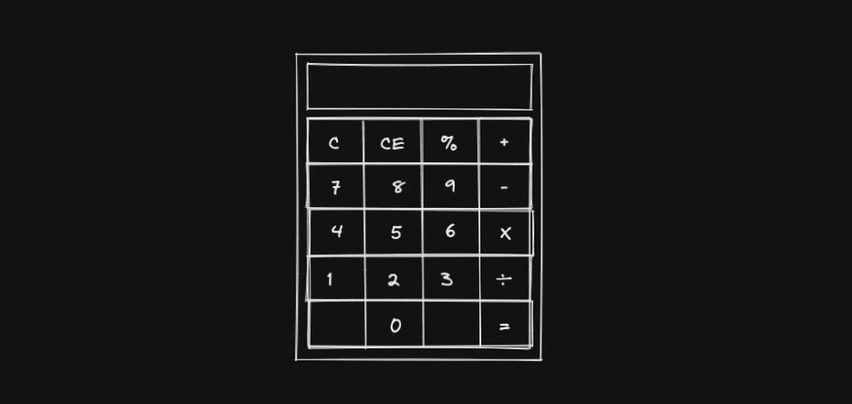

- Check running project at:
https://js-v-calculator.netlify.app/
---
- how to download, install and run on your computer:
  * in your terminal run: 
    * git clone git@github.com:ggiacomini2012/calculadora-js-vanilla.git
    * cd calculadora-js-vanilla && npm install && npm run dev
  * open a browser and go to: http://127.0.0.1:5173/ 
---
Developed using: 
* vite: ^3.1.0, javascript, html and css.
---
- Prototype Image:

---
- Final product:
